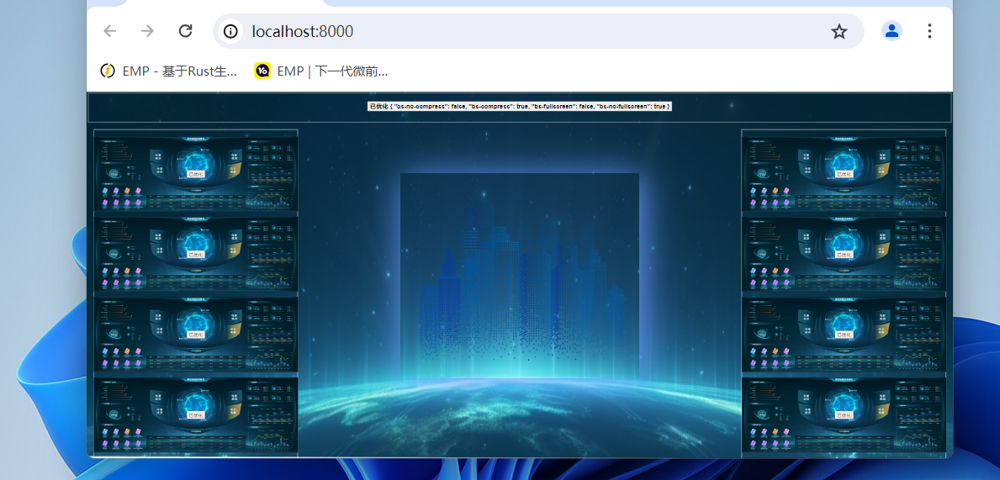

# bigscreen-fit
大屏适配方案、scale、可不压缩、不黑边、适配浏览器缩放、不同分辨率、提供全屏、退出全屏、判断全屏、提供缩放不同状态的classname

- code
### bs-config-provider
#### Props
```ts
interface PropsType {
    id?: string,
}
```

- code
### bigscreen-fit
#### Props
```ts
interface PropsType {
    designWidth?: number;
    designHeight?: number;
    zoom?: number | ((isFullScreen: boolean) => number);
    id?: string;
    push?: boolean;
    compress?: boolean | 'auto';
    origin?: string;
    customScale?: string | 'auto';
    zIndex?: number;
}
```
#### methods
```ts
declare function updateWinOption: (): void;

```
#### share 
```ts
   declare function usResizeObjserver(el: Element, callback: (enter: Enters) => void): void  // 监听一个元素变化
   declare function onFullScreenChange(callback: (isFunllscreen: boolean) => void): void  // 监听全屏变化
   declare function enterFullScreen() // 进入全屏
   declare function exitFullScreen() // 退出全屏
   declare function isFullScreen() //  是否全屏
```

### 组件引入方式
```ts
import { components, share } from '@enhances/bigscreen-fit';
const { BigScreenFit, BsConfigProvider } = components;

```


### demo code



- code
```vue
<template>
    <div class="app">
    <BsConfigProvider>
        <BigScreenFit>
            <template v-slot:default="{ customClass }">
            <div class="container">
                <div class="header">
                    <BigScreenFit :z-index="2" :push="headPush" :custom-scale="headPush ? 'auto' : '1'">
                        <div class="header__text">
                            <button @click="headPush=!headPush">
                                 {{ headPush ? '已优化': '点击优化头部压缩' }}  {{ customClass }}
                            </button>
                        </div>
                    </BigScreenFit>
                </div>
                <BigScreenFit :push="push" :custom-scale="push ? 'auto' : '1'">
                    <template v-slot:default="{ customClass }">
                        <div class="left_container flex-box">
                        
                                <DemoBox :class="customClass">
                                    <button @click="push=!push">
                                    {{ push ? '已优化': '点击优化压缩' }}
                                    </button>
                                </DemoBox>
                                <DemoBox :class="customClass">
                                    <button @click="push=!push">
                                    {{ push ? '已优化': '点击优化压缩' }}
                                    </button>
                                </DemoBox>
                                <DemoBox :class="customClass">
                                    <button @click="push=!push">
                                    {{ push ? '已优化': '点击优化压缩' }}
                                    </button>
                                </DemoBox>
                                <DemoBox :class="customClass">
                                    <button @click="push=!push">
                                    {{ push ? '已优化': '点击优化压缩' }}
                                    </button>
                                </DemoBox>
                        
                        </div>
                        <BigScreenFit :push="true">
                            <CenterBox></CenterBox>
                        </BigScreenFit>
                        <div class="right_container flex-box">
                                <DemoBox :class="customClass">
                                    <button @click="push=!push">
                                    {{ push ? '已优化': '点击优化压缩' }}
                                    </button>
                                </DemoBox>
                                <DemoBox :class="customClass">
                                    <button @click="push=!push">
                                    {{ push ? '已优化': '点击优化压缩' }}
                                    </button>
                                </DemoBox>
                                <DemoBox :class="customClass">
                                    <button @click="push=!push">
                                    {{ push ? '已优化': '点击优化压缩' }}
                                    </button>
                                </DemoBox>
                                <DemoBox :class="customClass">
                                    <button @click="push=!push">
                                    {{ push ? '已优化': '点击优化压缩' }}
                                    </button>
                                </DemoBox>
                        
                        </div>
                    </template>
                </BigScreenFit>
            </div>
        </template>
        </BigScreenFit>
    </BsConfigProvider>
    </div>
</template>

<script lang="ts" setup>
import { components, share } from '@enhances/bigscreen-fit';
const { BigScreenFit, BsConfigProvider } = components;

import DemoBox from './comp/demo_box.vue';
import CenterBox from './comp/center.vue';

import { ref } from 'vue';
const push = ref(true);
const headPush = ref(true);
</script>
<style lang="scss">
body {
    margin: 0;
    padding: 0;
    overflow: hidden;
}
</style>
<style lang="scss" scoped>
.container {
    background: url('~@/assets/bg.png');
    background-size: 100% 100%;
    width: 100%;
    height:1080px;
    display: flex;
    justify-content: space-between;
}
.left_container {
    position: absolute;
    left: 20px;
   
}
.header {
    width: 100%;
    height: 85px;
    border: 1px solid #fff;
    margin: 3px;
}
.header__text {
    height: 85px;
    display: flex;
    justify-content: center;
    align-items: center;
  
    button {
        font-size: 18px;
        font-weight: 600;
    }
}
.flex-box {
    width: 600px;
    height: calc(1080px - 110px);
    display: flex;
    flex-direction: column;
    justify-content: space-between;
    gap: 15px;
    box-sizing: border-box;
    padding: 20px 0;
    margin-top: 110px;

}
.right_container {
    position: absolute;
    right: 20px;
}
</style>

```